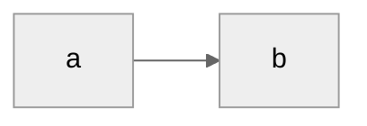

---
# =======================================================================================================
# =======================================================================================================
#
# Instructions:
#     0. READ THE SUBMISSION TERMS FIRST: https://stemerot.com/contribution-terms/
#     1. Create a folder titled the same as the topic that is related to the post you want to create.
#     2. Include the contents of this file in the generated directory and give this file your preferred name for your post.
#        The file should have an .md extension.
#     3. Include in the same folder every photo or auxiliary file that is needed to deliver your article.
#     4. Update the md file as needed (follow the instructions, TODOs should all be resolved) to write your post.
#     5. Zip the folder and send us the zipped file.
#
# Example:
#   Let's say that you want to create a post titled 'humans-vs-machines'. This post's topic is related to 'technology'.
#   And you also want to include 2 different images in the post.
#
#   Then your structure should look like this:
#     .
#     └── technology
#         ├── photo1.webp
#         ├── photo2.webp
#         ├── thumbnail.webp
#         ├── user-photo.webp  (if this is your first post)
#         └── humans-vs-machines.md
#
# The file that you will sent to us, should be either a zip or a tar file.
# Send the generated file to:   posts<[at]>stemerot<[dot]>com
#
# ====================================
#              IMPORTANT
# ====================================
#
# Submission Terms and Conditions
#
# By submitting your content to this site, you agree to the terms specified in this URL: 
# https://stemerot.com/contribution-terms/
#
# If you do not agree with these terms, please do not submit your content!
#
# =======================================================================================================
#

# ------------------------------------------------------------------------------------------------------
title: "Ο τίτλος του post στα ελληνικά" # TODO: Title of the blog post.
date:  2025-01-13                       # TODO: Date of post creation.
lastmod: 2025-01-16                     # TODO: Date of post last modification.
publishdate: 2025-01-16                 # TODO: Date of post publication date.
# ------------------------------------------------------------------------------------------------------

# ------------------------------------------------------------------------------------------------------
# TODO: Add a small summary (summary will be visible to the post card, along with the title)
summary: ""
# ------------------------------------------------------------------------------------------------------

# ------------------------------------------------------------------------------------------------------
# TODO: Add a small description (is used for indexing, can be the same as summary)
description: "" 
# ------------------------------------------------------------------------------------------------------

# ------------------------------------------------------------------------------------------------------
# TODO: Add one or more tags (MANDATORY TO CONTAIN! SEE available tags on the site)
tags: 
  - example-machines
  - example-computers
  - example-humans
# ------------------------------------------------------------------------------------------------------

# ------------------------------------------------------------------------------------------------------
# TODO: Add the topic on which the post is relevant to (ONLY ONE acceptable)
topics:
  - example-technology
# ------------------------------------------------------------------------------------------------------

# ------------------------------------------------------------------------------------------------------
# TODO: Add the path of your thumbnail (Only acceptable format is webp)
image: "/img/posts/topic/thumbnail.webp"
# TODO: Add what your thumbnail shows
imgAlt: "Thumbnail: TODO"
# ------------------------------------------------------------------------------------------------------

# ------------------------------------------------------------------------------------------------------
# TODO: Put here your author alias.
# If this is your first post, then edit also the following fields but keep them commented out 
# authoralias:
#   first_name: ""
#   last_name: ""
#   social_linkedin: ""
#   social_facebook: ""
#   social_instagram: ""
#   social_github: ""
#   social_x: ""
#   social_email: ""
#   photo: "/img/authors/"
#   bio: ""
#   bio_long: |
#     Multiline
author: ""
# ------------------------------------------------------------------------------------------------------

# ------------------------------------------------------------------------------------------------------
# Keep these fields as is, admin users will update these value as needed
popularity: 50
draft: true
# ------------------------------------------------------------------------------------------------------

# Add here any references you may have as a list
references:
  - ''
---

# Header title

Put here your initial content, i.e. introduction etc.

To create a separator, use this '---', see the example below:

---

In this section, we will showcase how different kinds of input can be inserted.

### 1. Inline Equations
When you want to include inline equations, then put your paragraphs into \<p\> tags and your equations inside \\( ... \\).

Example:
<p>
  This is an inline equation: \(y_y=mx+2\).
</p>

---

### 2. Multiline equation
For multiline equations use $$

Example:
$$
  P_r(d)=\frac{P_tG_tG_r\lambda^2}{(4\pi)^2d^2} 
$$

--- 

### 3. Code
To insert code blocks in your posts, use the normal markdown approach.

Example:
```
mv input.txt output.txt
mkdir -p test
touch test/test
```

---

### 4. Diagram

It is also possible to add inline diagrams using mermaid.

Example:


---

### 5. Figure

To inlude figures there are 2 approaches.

#### A. Without references
Regarding figures, the preferable method is the following:



#### B. With references
<figure class="custom-figure" style="margin: 0; padding: 0; text-align: center;">
  
    <figcaption class="figure-caption" style="margin-top: 0.1em; font-size: 0.85em; color: #555;">
        TODO (<a href="TODO" style="color:inherit; font-size: 0.85em;">URL</a>)
    </figcaption>
</figure>

#### Guidelines: 
1. In case the provided images are not created by you, and if required by the original file's license holder, then you need to cite the source. In this case, use the B. approach, since the A. approach is not yet possible for citations.
2. If your submitted images are transparent (remember, they should still be in .webp format), then you can use class="invert-in-dark" to support both dark and white themes.

#### For thumbnails you can use free content from:
- https://www.pexels.com/
- https://pixabay.com/
- https://unsplash.com/s/photos/commercial-use

### 6. Admonitions

This is a warning message. 
<br>
Multiline



This is an error message.
<br>
Multiline



This is a note or informational message.
<br>
Multiline



This is a caution message.
<br>
Multiline



This is an important message.
<br>
Multiline
